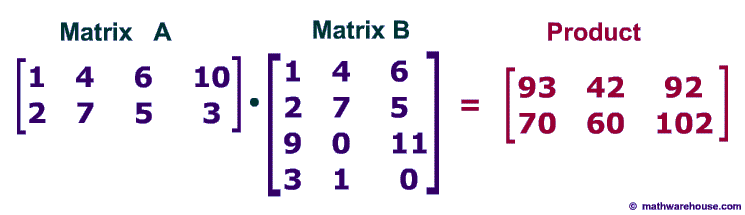

```{r, setup, include=FALSE}
# set this option in the first code chunk in the document
knitr::opts_chunk$set(echo = params$printcode, results= params$printresults, warning = FALSE)
```

# Programska orodja za statistiko

* splošni programski jeziki, low-level (nizko-nivojski), hitrejši (Fortran, C/C++, Java, Python,...)
* bolj matematično statistični, uporabniku prijaznejši (Mathematica, Matlab/Octave, R, Julia)

## R

* uporablja vektorje, matrike in delo z njimi
* open-source
* najbolj uporabljan jezik v statistiki
* uporabniki dograjujejo njegovo funkcionalnost s programskimi paketi
* instalacija z osnovnim grafičnim vmesnikom
  + RStudio za dodatne funkcionalnosti
  + IDE (integrated development environment)
* dokumentacija dosegljiva prek RStudia, na spletu, forum *stackexchange* (omejite se z [R])

## RStudio, Rmarkdown

cheatsheet **rstudio-IDE** 

- ukazna vrstica, R Markdown izpis 
- help, knjižnice, pregled grafov, pregled datotek v mapi
- gobalno okolje (Global Environment), zgodovina ukazov
- datoteke (bližnjice \<Ctrl\> + \<Enter\>, \<Ctrl\> + \<Shift\> + \<Enter\>)

cheatsheet: **rmarkdown**

- .Rmd datoteka
- reproducible research (ponovljive raziskave)
- koda v R med tremi enojnimi narekovaji in crko `r`: \`\`\`{r } \<code\> \`\`\`
- R koda znotraj besedila med enima enojnima narekovajema in crko `r`: \`{r \<code\>}\`
- enačbe kot v LaTeX-u (cheatsheet **LaTeX**)
- za kreiranje PDF dokumentov:
`install.packages('tinytex');`
`tinytex::install_tinytex()`

#### Naloge
  + Naredite nov .Rmd dokument kot je [tukajle](rmd/first_rmd.html).

# Osnovni gradniki v R

\# - znak pred komentarjem

? - znak za izpis pomoči (ali pa uporaba funkcije `help()`)

cheatsheet: **base-r**

## Vrste stavkov

### Izrazi
```{r}
2+4
```
### Prirejanja
```{r}
a1 = 1+6
a2 <- "vaje"
a3 = a1 == a2
```
`a1` je objekt, ki je shranjen v globalnem okolju.

Logične primerjave:
`==, !=, <, >, is.na(), is.null()`

Operacije:
`+, -, /, *, %%, %/%` (zadnja dva: deljenje po modulu in celoštevilsko deljenje)

## (Osnovne) vrste objektov

### Skalar 
```{r}
as1 = 1 # numeric
as2 = "Uporabna statistika" # character
as3 = TRUE # logical
str(as3)
class(as3)
is.numeric(a1)
as.numeric(a3)
ls() # list of objects
```
Datume bomo obravnavali kasneje.

#### Naloge
  + Kakšna je numerična vrednost `as3`?
  + Kako izbrišemo vse, kar je trenutno v globalnem okolju? Poglejte v help funkcije `rm()`.

```{r, echo=TRUE, eval=TRUE, results="markup"}

# setting global seed for reproducability
set.seed(8)

# solutions

# as3 = TRUE
as.numeric(as3)
# equal to 
as.numeric(TRUE)

# a way to remove all global variables (found in ?rm)
rm(list=ls())

```


Posebne vrednosti: 

  + `NA` - not available
  + `pi` - $\pi$
  + `NaN` - not a number
  + `Inf` - infinite value
  + `NULL` - brez vrednosti, prazno
  + `TRUE` in `FALSE` (okrajšavi `T` in `F`)

### Vektor
```{r}
av1 = c(1,2,3,4,5)
av2 = vector(mode="character",length=4)
av2
class(av2)
av2[1] = "\u017Div\u00E9" # Žive
av2[2] = "naj"
av2[4] = "narodi"
av2
av2[-1] 
av3 = 1:10
length(av3)
```
#### Naloge
  + Naredite vektor `av4`, v katerem so števila in znaki. Izpišite ga na zaslon. Kakšnega tipa je?
  + Vektor `av3` skrajšajte:
      - na prve tri znake,
      - na zadnja dva znaka, 
      - izberite le vsak drugi znak,
      - vektor naj vsebuje samo lihe številke
  + Vektor `av2` podaljšate za naslednjo vrstico Zdravljice.
  + Kaj se zgodi, če seštejemo `av1` in `av3[1:2]`?

Seštevamo lahko tudi vektorje neenakih dolžin, vendar moramo biti pri tem **zelo pazljivi**! (npr. prištevamo skalar)

```{r, echo=TRUE, eval=TRUE, results="markup"}

# solutions

# av4 creation
av4 = c(8, 22, 9, "Alen", "Kahteran")
# printing av4
print(av4)
# type of av4
typeof(av4)

# shortening av3 to first 3 elements
av3[1:3]
# shortening av3 to last 2 elements
av3[(length(av3) - 1):length(av3)]
# only selecting every second element in av3
av3[seq(2, 10, 2)]
# only selecting odd numbers in av3
av3[av3 %% 2 == 1]

# imputing 3rd element of av2 as it's missing
av2[3] <- "vsi"

# adding the next row of Zdravljica
next_row <- c("ki", "hrepené", "dočakat", "dan")

for (i in 5:8) {
    av2[i] <- next_row[i-4]
}

print(av2)

# what happens when summing av1 and av3[1:2]
print(sum(av1, av3[1:2])) # we get the sum of all elements

# as I assume the above wasn't the anwser that was expected
av1 + av3[1:2] 
# this above returns a warning message that we can't sum objects with different 
# lengths which are not a multiple of eachother.
# what it does it expands the second vector to match the length and then sums.
# the warning is raised as it has to slice the second vector at the end.

# this would work (without warning) as only 1 element of av3 was added to each element 
# of av1 (objects match by multiple length)
av1 + av3[1] 

# this could work as well
av1 + av3[1:5] 
# this sums av1 and av3[1:5] element-wise (first with first, second with second, etc.)

# in cases where some object lengths are a multiple of eachother R automatically 
# multiplies the shorter one by the multiplier so the lenghts match.

```

### Matrika
```{r}
am1 = matrix(c(1:6),nrow=2)
am1
am1[2,3] = 10
am1
am1[2,] # second row
is.matrix(am1)
dim(am1)
# dimensions can be added to the vector
dim(av3) = c(1,10) 
# matrix as binded vectors
am2 = cbind(av1,av1)
class(am2)
str(am2)
colnames(am2)
am3 = rbind(av1,av1,rev(av1))
am1[1,]
am1[1,,drop=FALSE] # preserve dimensions
```

#### Naloge
  + Seštejte dve matriki `am1`.
  + Zmnožite `am1`z 2.
  + Kaj dobite z naslednjim izrazom: `am1*c(1,2)` ? Zakaj?
  + Kaj dobite z naslednjim izrazom: `am1*c(1,2,3)` ? Zakaj?
  + Kaj dobite, če po vrsticah skupaj združite `av1` in vektor `1:8`? Zakaj?
  + Kaj dobite, če želite po stolpcih združiti `av1` in `av2`? Zakaj?
  + Kaj omogoča parameter `byrow` v funkciji `matrix`? Zapišite primer.
  
Vektorsko množenje in množenje matrik (`%*%`):
```{r, echo=TRUE, eval=TRUE, results="markup"}

# solutions

# sums element-wise
am1 + am1

# multiplies 2 with every element
am1 * 2

# multiplies 1st row with 1 and 2nd row with 2
am1*c(1, 2)

# multiplies 1st column with 1, 2nd column with 2, 3rd column with 3
am1*c(1, 2, 3)

# why? I assume R checks the lengths, as you can't multiply column-wise
# in this particular example if the vector we're multiplying with is shorter
# than the matrix size.

# returns a matrix of size 2x8, as av1 vector is length 5, it expands it
# so the lenghts match (adds first three elements to the end).
# why? it's somewhat senseless to bind if the lenghts don't match.
# also, if the lenghts are a multiple of eachother, it does the same but dosen't
# raise a warning.
rbind(av1, 1)

# this does similarly as above, but in this case as the types don't match
# it converts the numeric type to character type as the data in matrix can only
# be of one type. (also expands the first vector as it is shorter)
cbind(av1, av2)

# returns a matrix of size 2x3 where the selected method of filling is column-wise
# which means first fills the values sequentially in first column, then second, etc.
matrix(c(1, 1, 1, 2, 2, 2), nrow = 2)

# returns a matrix of size 2x3 (byrow=FALSE by default)
# similarly as above, byrow setting just changes the filling method to rows.
matrix(c(1, 1, 1, 2, 2, 2), nrow = 2, byrow=TRUE)
```

```{r}
am1 %*% t(am1) # transpose
av1 %*% t(av1)
as.matrix(av1)
av1 %*% av1
t(av1) %*% av1
```

#### Naloge
  + Izračunajte naslednji produkt (preverite, ali je rezultat na desni pravilen)
  
  
  + Preverite v help-u, kaj naredi funkcija `solve`. (`?solve`)
  + Uporabite funkcijo `solve`, da boste dobili kvadratno matriko X dimenzije 4x4, za katero velja, da `Y %*% X = Y`. Matrika Y naj bo katerakoli matrika dimenzije 4x4. Zakaj dobite tak rezultat?

```{r, echo=TRUE, eval=TRUE, results="markup"}

# solutions

# defining matrix A and matrix B
matr_a <- matrix(c(1, 4, 6, 10, 
                   2, 7, 5, 3), 
                 nrow=2, 
                 byrow=TRUE)

print(matr_a)

matr_b <- matrix(c(1, 4, 6, 
                   2, 7, 5, 
                   9, 0, 11, 
                   3, 1, 0), 
                 nrow=4,
                 byrow=TRUE)

print(matr_b)


# product
prod_matr <- matr_a %*% matr_b

print(prod_matr)

# result from image
result <- matrix(c(93, 42, 92, 
                   70, 60, 102), 
                 nrow=2,
                 byrow=TRUE)

# do all values match?
all(prod_matr == result)


# solve() solves the equation a %*% x = b for x, where b can be either a vector or a matrix. 
# (from ?solve)
matr_y <- matrix(c(1,  2,  3,  4,
                   5,  6,  7,  8, 
                   9,  10, 11, 12, 
                   13, 14, 15, 16), 
                 nrow=4,
                 byrow=TRUE)

print(matr_y)

# this case can't be solved as the matrix is not invertable
# solve(matr_y, matr_y)
# commented due to otherwise .rmd not compiling.

# as this inverts one of the matrixes to solve the problem the matrix must be invertable
# one of the cases when a matrix is not invertable is when the determinant is equal to 0.
det(matr_y)
# 4.733165e-30 - which is basically 0, within machine precision (floating point error).

# example of a matrix with non-zero determinant
matr_y2 <- matrix(c( 1,  0, 2, 0,
                    -4, -3, 1, 5,
                    -6,  2, 4, 1,
                     0,  1, 3, 0),
                  nrow=4,
                  byrow=TRUE)

print(matr_y2)

# determinant
det(matr_y2)

# usage of solve again.
ret_matrix <- solve(matr_y2, matr_y2)

# returns an identity matrix, as this is the only possible solution anyway.
# This is the only matrix which if any matrix is multiplied by the identity matrix 
# it returns the "original" matrix

print(ret_matrix)

```


### Seznam
```{r}
al1 = list(ime=c("Anton","Janez"),priimek=c("Novak","Trilar"),starost=c(67,58,34))
al1[1]
al1$priimek
al1$starost[3]
al1[[3]]
al1[[3]][1]
names(al1)
```

Seznami so uprabni za združevanje več (različnih tipov) objektov v skupni objekt. Rezultati funkcij so ponavadi seznami različnih objektov.

### Podatkovni okvir (osnovna statistična tabela)
```{r}
#df1 = data.frame(ime=c("Anton","Janez"),priimek=c("Novak","Trilar"),starost=c(67,58,34))
df1 = data.frame(ime=c("Anton","Janez"),priimek=c("Novak","Trilar"),starost=c(67,58))
df1
df1$starost
df1[,"priimek"]
df1[[2]]
dim(df1)
names(df1)
rownames(df1) = c("oseba1","oseba2")
df1
str(df1)
class(df1)
class(df1$ime)
```

Faktor je poseben tip podatka. Gre za opis kategorialnih podatkov, ki jim lahko priredimo opis posameznih kategorij in povemo, ali so urejeni.

```{r}
af1 = c(0,0,0,0,1,1,1,1) # 4 men, 4 women, numeric
af2 = as.factor(af1)
af2
as.numeric(af2) # factor  starts with 1, levels sorted
af3 = factor(af1,levels = c(0,1),labels=c("M","F")) # ordered=TRUE for ordered factors
af3
```

#### Naloge
  + Iz `af3` izbrišite vse moške in shranite rezultat v `af4`. Kakšen je izpis? Katere vrednosti ima lahko faktor?
  + Ali lahko faktor dodamo novo kategorijo? V `af3` poskusite dodati kategorijo `O` - otrok. Kaj se zgodi? Kako boste dodali otroka, da bo to tudi nova kategorija?
  + Poženite ukaz `data()`.
  + Za podatkovje `USArrests` ugotovite, kaj so statistične enote in preverite, kakšne spremenljivke imamo na voljo (katerega tipa, kaj pomenijo).
  + Prikažite le imena držav.
  + Izberite iz podatkov vse države, ki imajo vsaj 70% populacije urbane. Koliko jih je?
  + Iz podatkov izbrišite spremenljivko `Rape`.
  + Kaj se zgodi, če `USArrests` spremenimo v matriko? Zakaj?

```{r, echo=TRUE, eval=TRUE, results="markup"}

# solutions

# remove all "M" values.
af4 <- af3[af3 != "M"]

print(af4)

# output returns only "F" values. Factor can only hold specific values which are usually
# predetermined. In this case af4 can hold "M" and "F".

# can we add a new factor category? yes
# labels and levels needed to be changed as they now have different values.
factor(af3, 
       levels=c("M", "F", "O"), 
       labels=c("M", "F", "O")
       )
# if we wanted to do the same from af1, and number 2 represent a child ("O")
factor(af1, 
       levels=c(0, 1, 2), 
       labels=c("M", "F", "O")
       )

# data() returns all data sets within R.

### USArrests

# the statistical units are US states.

# Murder represents Murder arrests per 100.000 people.
# Assault represents Assault arrests per 100.000 people.
# UrbanPop represents percent of urban population.
# Rape represents Rape arrests per 100.000 people.

# all of the values are numeric (double or integer)
typeof(USArrests$Murder)
typeof(USArrests$Assault)
typeof(USArrests$UrbanPop)
typeof(USArrests$Rape)
# displaying US state names.
rownames(USArrests)
# selecting US states with at least 70% urban population
USArrests[USArrests$UrbanPop >= 70, ]
# how many?
nrow(USArrests[USArrests$UrbanPop >= 70, ])

# remove Rape from data.frame
USArrests$Rape <- NULL

print(USArrests)
# what happens when converting `USArrests` into a matrix, why?
matrix(USArrests)
# it uses each column as an object which is then placed sequentially 
# Why? as data.frame is basically a list of lists (or list of vectors) 
# in the background. So basically matrix() function is trying to convert a list
# of 3 objects into a matrix which it succeeds. It is usually not what we want


```


### Array (večdimenzionalna tabela)
```{r}
aa = array(dim=c(3,5,2))
aa[1,,2] = "M" 
aa[,,1] = 3
dimnames(aa) = list(c("oseba1","oseba2","oseba3"),c("cas1","cas2","cas3","cas4","cas5"),c("treatment","placebo"))
```

<!-- # Osnove programiranja -->

<!-- ## If stavek -->

<!-- ```{r} -->
<!-- x = 3 -->
<!-- if (x > 0){ -->
<!--   x = x + 1 -->
<!-- } else { -->
<!--   x = x - 1 -->
<!-- } -->
<!-- x -->
<!-- ``` -->

<!-- Pogoj mora biti zapisan v oklepajih. Pogoje lahko poljubno sestavljamo z: -->
<!-- `!, &, &&, |, ||, xor(), isTRUE(x), isFALSE(x)`  -->

<!-- Kratki if stavek (le, če v je v telesu if stavka samo eno prirejanje): -->
<!-- ```{r} -->
<!-- ifelse(x > 0, x+1, x-1) -->
<!-- ifelse(x > 0, x+1, x-1) -->
<!-- ``` -->

<!-- #### Naloge -->
<!--   + Napišite if stavek, ki bo izračunal `a/b` in vrnil izpis na standardni izhod. Če izračun ni mogoč, se na standardni izhod izpiše `Deljenje z 0 ni definirano.`. -->
<!--   + Zakaj je v drugem primeru (kratek if stavek) obakrat rezultat (`x`) enak? -->
<!--   + Kaj vrne `isTRUE(x)`? Kaj pa `isTRUE(as.logical(x))`? Zakaj? -->
<!--   + Zapišite kratki if stavek, ki bo za vse države iz `USArrests` določil novo spremenljivko `Urban`, ki bo imela vrednost `yes`, če je v državi več kot 75% urbane populacije, sicer `no`. -->

<!-- ## For zanka -->

<!-- ```{r} -->
<!-- for (i in 1:10){ -->
<!--   print(i) -->
<!-- } -->
<!-- ``` -->
<!-- #### Naloge -->
<!--   + Preverite, kaj se zgodi, če v telesu zanke zapišemo le `i`. -->
<!--   + Zapišite if stavek s pomočjo for zanke, ki bo za vse države iz `USArrests` določil novo spremenljivko `Urban2`, ki bo imela vrednost `yes`, če je v državo več kot 75% urbane populacije, sicer `no`. -->
<!--   + S pomočjo for zanke seštejte vse vrednosti v številskem vektorju `1:100`. Ko to naredite, izpišite še povprečje. -->
<!--   + V vektorju `av2` sta zapisani prvi dve kitici Zdravljice. Zapišite vsako besedo v svoji vrstici s pomočjo for zanke in poleg še dolžino besede, ki je izpisana (uporabite funkciji `strsplit()` in `paste()`).  -->
<!--   + S pomočjo for zanke zapišite vsako kitico Zdravljice iz `av2` v svojo vrstico (kitica je dolga 4 besede). -->

<!-- ## While zanka -->

<!-- ```{r} -->
<!-- x = 2345 -->
<!-- while (x > 100){ -->
<!--   x = x/2 -->
<!--   print(x) -->
<!-- } -->
<!-- ``` -->

<!-- ## Funkcija -->

<!-- ```{r} -->
<!-- # definition -->
<!-- square <- function(x){  -->
<!--   squared <- x*x -->
<!--   return(squared) -->
<!-- } -->
<!-- # function call -->
<!-- square(3) -->
<!-- ``` -->

<!-- ```{r} -->
<!-- # arguments -->
<!-- powerX <- function(x,p = 2){  -->
<!--   result = 1  -->
<!--   for(i in 1:p){ -->
<!--     result = result * x -->
<!--   } -->
<!--   return(result) -->
<!-- } -->
<!-- # function call -->
<!-- powerX(4) -->
<!-- powerX(x=4,p=3) -->
<!-- powerX(3,2) -->
<!-- powerX(p=3,x=2) -->

<!-- powerX <- function(x,p = 2){  -->
<!--   x^p -->
<!-- } -->
<!-- powerX(p=3,x=2) -->
<!-- ``` -->


<!-- #### Naloge -->
<!--   + Zapišite funkcijo, ki izračuna vzorčni standardni odklon opazovanj, ki so shranjena v nekem številskem vektorju. Preverite, ali deluje pravilno. -->
<!--   + Zapišite funkcijo, ki na standardni izhod izpiše cela števila od neke številke `a` do `b`. To naj se izvrši le, če je mogoče in, če sta številki za največ 20 števil narazen. Preverite, ali funkcija deluje. -->
<!--   + Naredite 3 funkcije za pretvorbo med temperaturnimi lestvicami: -->
<!--     - Kelvin_to_Celsius ($cel = kel - 273.15$) -->
<!--     - Celsius_to_Fahrenheit ($fahr = cel*9/5 + 32$) -->
<!--     - Kelvin_to_Fahrenheit (tako, da uporabite zgornji funkciji) -->
<!--   + Z bisekcijo bi radi dobili $x$, kjer je $f(x) \approx 0$, za funkcijo $f(x) = x^3 - x - 2$ med točkama 1 in 2.  -->

<!--     ALGORITHM: The input for the method is a continuous function $f$, an interval $[a, b]$, and the function values $f(a)$ and $f(b)$. The function values are of opposite sign (there is at least one zero crossing within the interval). Each iteration performs these steps: -->

<!--     - Calculate $c$, the midpoint of the interval, $c = (a + b)/2$. -->
<!--     - Calculate the function value at the midpoint, f(c). -->
<!--     - If convergence is satisfactory (that is, $c - a$ is sufficiently small ($c-a < 10^{-5}$), or $|f(c)|$ is sufficiently small ($|f(c)|< 10^{-5}$)), return $c$ and stop iterating. -->
<!--     - Examine the sign of $f(c)$ and replace either $(a, f(a))$ or $(b, f(b))$ with $(c, f(c))$ so that there is a zero crossing within the new interval. -->

<!--     NAVODILO: -->
<!--     - Najprej zapišite funkcijo f(x) kot funkcijo v R -->
<!--     - Naredite program, ki bo izračunal ničlo funkcije dovolj natančno. -->
<!--     - Program spremenite v funkcijo v R. Funkcija naj vsebuje 3 vhodne argumente: a, b in ime funkcije (ime funkcije je legalen vhodni argument). -->

<!-- Obstaja ogromno funkcij, ki so v R že definirane. Za vse lahko preverite, kakšni so njihovi vhodni parametri, kateri so *obvezni* in kateri *neobvezni*. -->

<!--   + `print` -->
<!--   + `length` -->
<!--   + `factor`  -->
<!--   + `sum` -->
<!--   + `mean` -->
<!--   + `var` -->
<!--   + `seq` zaporedje -->
<!--   + `rep` za hitro pisanje daljših vektorjev (times, each, length) -->
<!--   + `cut` za kategoriziranje spremenljivk -->
<!--   + `table` za povzemanje kategorialnih spremenljivk, tudi več kot ene -->
<!--   + `round`, `floor`, `ceiling`, `format` za zaokroževanje števil -->
<!--   + `which` za pridobivanje indeksov -->

<!-- #### Naloge (primeri za uporabo funkcij) -->

<!--   + Ugotovite, kako deluje funkcija `which`. Z njeno pomočjo dobite države, ki imajo vsaj polovico urbanega prebivalstva. -->
<!--   + Izračunajte povprečno število umorov (`USArrests`), dodajte mu vzorčno varianco. -->
<!--   + Zapišite zaporedje sodih naravnih števil do 100. -->
<!--   + Izpišite vektor, ki ima 10 enic, 5 dvojk, 6 trojk in 20 štiric (v tem vrstnem redu). -->
<!--   + Dodajte podatkovju `USArrests` še spremenljivko `State`, kjer bodo zapisana imena držav. -->
<!--   + Dodajte podatkovju `USArrests` spremenljivko `Group`, ki bo države razdelila na 5 skupin (prvih 10 bo v 1. skupini itn.). Spremenite to spremenljivko v faktor, vrednosti naj bodo od `group1` do `group5`. -->
<!--   + Spremenljivko `USArrests$UrbanPop` kategorizirajte v naslednje kategorije: -->

<!--     - 0-39% -->
<!--     - 40-65% -->
<!--     - 66-80% -->
<!--     - nad 80% -->

<!--     Naredite faktor, ki bo urejen, imena kategorij si izmislite sami. Kot novo spremenljivko `UrbanCat` jo dodajte v `USArrests`. -->
<!--   + Na spremenljivki iz prejšnje naloge uporabite funkcijo `table`. -->
<!--   + Ali so skupine (spremenljivke `Group`) približno enakovredno porazdeljene glede na spremenljivko `UrbanCat`? Preverite s kontingenčno tabelo. -->
